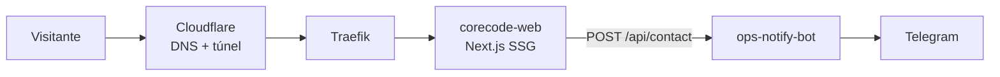

<div align="center">

# 🚀 corecode-web

**Web corporativa de Core Code Innovation. Landing, portfolio y blog técnico.**


</div>

---

## Qué es
Sitio de la empresa: servicios, portfolio (los otros repos como casos de estudio),
blog técnico en MDX y contacto (que notifica vía ops-notify-bot). Self-hosted
en el homelab tras Traefik, con Cloudflare delante. 100% estático (SSG) salvo la
API route del formulario de contacto.

## Quickstart

### Con Docker (recomendado)
```bash
cp .env.example .env.local   # completar NOTIFY_WEBHOOK_SECRET
docker compose up
```

### En local
```bash
cp .env.example .env.local
npm install && npm run dev
```

El sitio queda en `http://localhost:3000`.

## Tests
```bash
npm test          # unit (Jest): lib/ y la API route de contacto
npm run test:e2e  # e2e (Playwright): build + start reales, smoke de home/blog/contacto
```

## Arquitectura



- **Next.js 15** (App Router): landing, blog MDX (`content/blog/`) y sitemap/robots generados en build.
- **Contacto:** API route valida (honeypot anti-spam incluido) y reenvía al webhook de `ops-notify-bot` con secret compartido.
- **Analítica:** Umami self-hosted opcional vía `NEXT_PUBLIC_UMAMI_*` (si no está configurado, no se inyecta nada).

## Diseño
Usa `src/styles/tokens.css` — los design tokens de marca CCI. **No inventar colores**:
todo sale de las variables `--cci-*`. Dark-first: naranja `#FF5A1F` sobre carbón.

## Calidad
- Lighthouse (mobile): **100** accessibility · **100** best practices · **100** SEO · 91–96 performance (LCP limitado por el hero en slow-4G simulado).
- OG/Twitter images, JSON-LD de organización, sitemap y robots generados en build.
- Docker multi-stage (`output: standalone`), contenedor non-root con healthcheck.
- Tests unitarios (Jest) para la lógica del blog y la API route de contacto; e2e (Playwright) para home, blog y el formulario. CI corre ambos en cada push/PR.

## Roadmap
- [x] Layout base: tokens de marca, header/footer con monograma, fuentes (Poppins/Inter/JetBrains Mono)
- [x] Hero (logo) + sección de servicios
- [x] Portfolio (casos de estudio enlazando repos)
- [x] Blog MDX (fuente de posts LinkedIn)
- [x] Formulario de contacto -> ops-notify-bot
- [x] Lighthouse, SEO (OG, sitemap, JSON-LD), a11y
- [x] Tests unitarios (Jest) y e2e (Playwright), corridos en CI
- [ ] Página "sobre nosotros"
- [ ] Resaltado de sintaxis en el blog (rehype-pretty-code)
